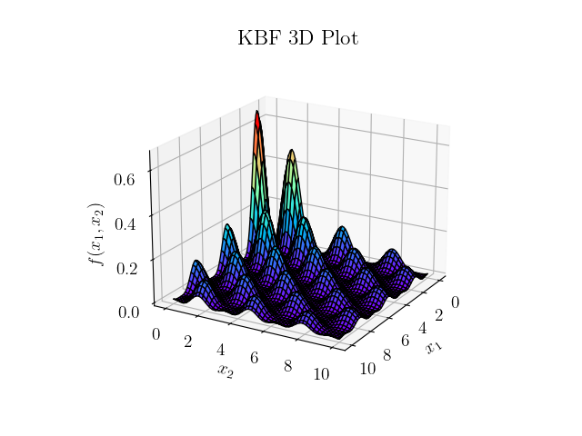
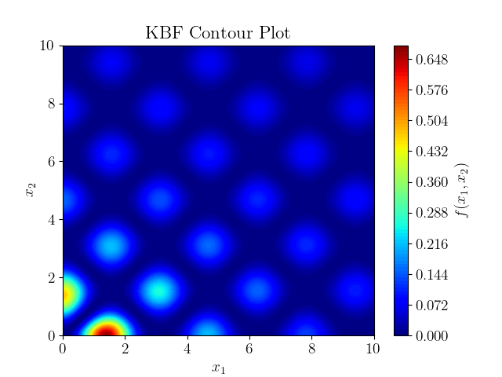

# Continuous Genetic Algorithm and Parallel Tempering for Optimisation of Keane’s Bump Function
Investigating the performance of Parallel Tempering (PT) vs Continuous Genetic Algorithms (CGA) on Keane’s Bump Function (KBF).

This project was completed as part of an undergraduate coursework submission at the University of Cambridge. The project was completed independently, and it ignited a keen interest in the subject matter, (hence the chunky report). 

## Introduction
This project delves into the comparison between the performance of Parallel Tempering (PT) and Continuous Genetic Algorithms (CGA) when applied to Keane's Bump Function (KBF). The KBF, a multimodal function rich in local minima, is visually presented in two dimensions below:

    
    

Navigating the optimisation challenges posed by the KBF produced some interesting outcomes. The results of the investigation are presented in the accompanying report.

## Running the Code
In a nutshell, the `CGA_TuningExperiments.py` file generates the figures presented in Section 3 of the report, while `PT_TuningExperiments.py` handles those for Section 4. The `FinalComparison.py` file is responsible for the results showcased in Section 5. Running any of these scripts will not only create the corresponding results but also store them in the figures folder.

In addition, the `src/algorithms/` directory hosts the classes implementing the CGA and PT algorithms, offering a closer look at the core functionalities. Meanwhile, the `src/utils/` directory provides a collection of utility functions crucial to the entire codebase. Each function is documented with a docstring, and the code itself is commented for clarity.

## Interesting Figures to Enjoy
Please read the report for a explanation of these tasty figures:

